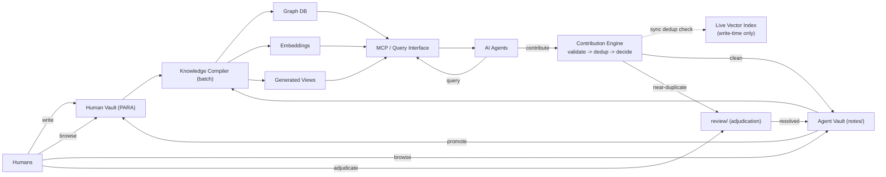

# knowledge-platform

A single repository for a multi-layer personal knowledge system serving **both humans and
AI agents**, with a clear separation of responsibility between curated knowledge, agent
operational memory, shared governance, and the tooling that enforces it.



## Layout

```Structure
knowledge-platform/
  Vault/          # the markdown vault — open THIS folder in Obsidian; sync THIS
    00 Governance/         #   shared rules (humans + agents): philosophy, metadata, policies
    Human/                 #   durable, human-curated knowledge (PARA-style)
      01 Inbox/AI/         #     AI Suggestions queue (Pipeline B) — nothing here is canonical
    Agent/                 #   AI operational memory (engine-managed)
      notes/  review/      #     flat, tag-organized, dedup-gated by the engine
      Promotion Candidates/#     agent memory staged for human promotion (Pipeline A)
    Templates/  Assets/
  engine/                  # the Python contribution engine (NOT synced into the vault)
    vault_contrib/  tests/  scripts/  specs/  docs/
```

**Separation of responsibility:** the `Vault/` folder is markdown only — it is what
Obsidian opens and what Syncthing replicates. Functional code lives in `engine/` and is kept
out of the synced vault. Everything is one git repo at the top level.

## The two knowledge layers

- **`Human/`** — protected, human-curated. Agents *propose* (`Human/01 Inbox/AI/`) and open
  `ai/*` pull requests; a human reviews and merges. See `00 Governance/Vault Philosophy.md`.
- **`Agent/`** — AI operational memory contributed through the engine, under the same
  governance (type `Agent Note`). Agents read and write here freely via the gate
  **validate → dedup → decide → write**.

Two routes carry agent work into Human knowledge — **AI Suggestions** (propose a specific
change) and **Promotion Candidates** (elevate durable agent memory). See
`00 Governance/AI Contribution Policy.md` and `Promotion Policy.md`.

## The engine

`engine/` is a tested Python package (Stage A: git + markdown + string/title dedup) built
behind clean ports for an eventual Postgres/pgvector + MCP swap (`engine/HANDOFF.md`). It is
monorepo-aware: it auto-commits agent contributions against this repo and never creates a
nested git repo.

```bash
cd engine
pip install -e .                 # one runtime dep: pyyaml
pytest                           # run the suite

# Point the engine at the Agent layer (set once in your environment):
#   KNOWLEDGE_VAULT="<repo>/Vault/Agent"
python -m vault_contrib.cli contribute --by agent:me --title "…" --body "…" --tags a,b
python -m vault_contrib.cli list
python -m vault_contrib.cli index    # writes Agent/INDEX.md (gitignored)
```

The `knowledge-vault` skill (`engine/.claude/skills/`) wraps this for agents; deployed copies
are kept in sync by `engine/scripts/sync_skill.py`.

## Governance enforcement

The `vault_governance` package (beside `vault_contrib`) enforces metadata correctness across the
whole vault — **property inheritance, schema validation, and metadata linting** — driven by
machine-readable schemas in `Vault/00 Governance/Schemas/` that mirror the prose governance docs.

```bash
cd engine
python -m vault_governance.cli validate --vault ../Vault      # schema/policy (exits 1 on error)
python -m vault_governance.cli lint     --vault ../Vault --fix # normalize Agent/non-canonical notes
python -m vault_governance.cli check-policy --base origin/master --head HEAD   # gate ai/* branches
```

CI (`.github/workflows/vault-governance.yml`) runs these on every push/PR; local git hooks live
in `.githooks/` (`git config core.hooksPath .githooks`). Details: `engine/specs/vault-governance.md`.

## Sync & remote (operator setup)

This repo was consolidated from three earlier repos (the published Obsidian vault, the engine,
and the live agent vault). Their histories are preserved as git bundles outside the tree.
Re-establish the GitHub remote and Syncthing **on the `Vault/` subfolder** (not the
whole repo, so engine code is not synced to devices) when ready — see `MIGRATION-REPORT.md`.
